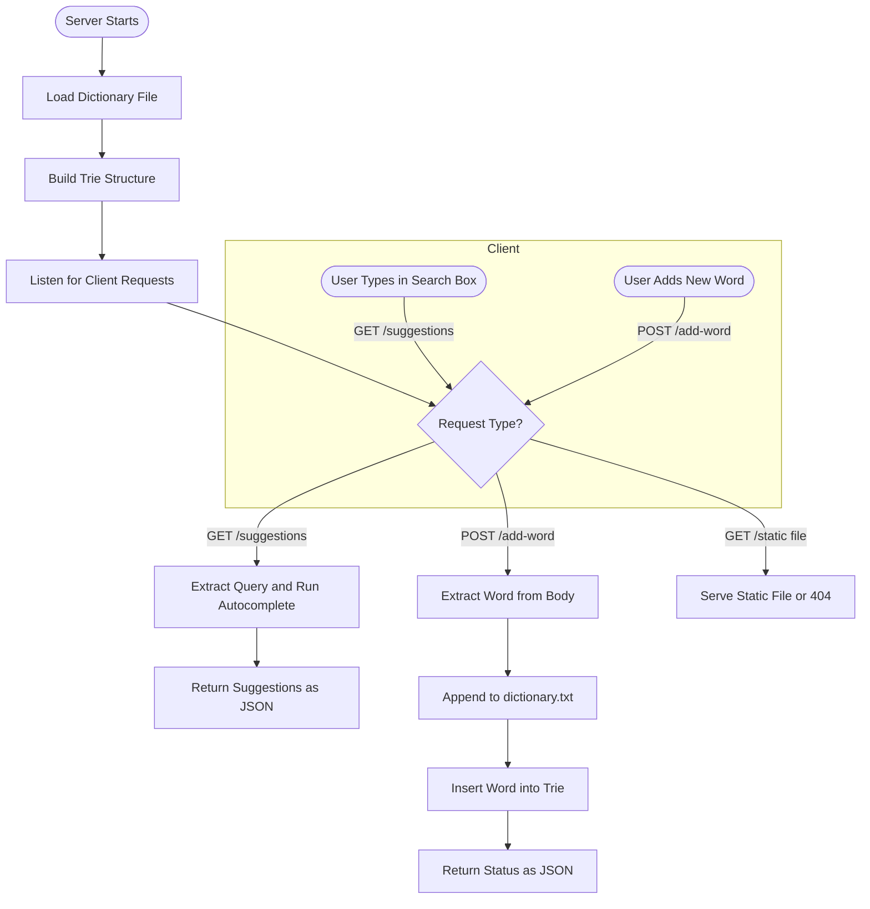

# Smart Search

Smart Search is a lightweight, responsive autocomplete system that delivers intelligent word suggestions based on prefix, infix, and suffix patterns. It uses a combination of Trie and Suffix Trie data structures to offer efficient real-time search capabilities. The system consists of a C++ backend server that handles fast query processing and word addition, and a modern frontend interface built with HTML, CSS, and JavaScript. Users can interact with the system through an intuitive UI or programmatically via REST-style endpoints, making it a flexible and extensible platform for enhancing search experiences.

## Why a Trie?
A Trie (or prefix tree) stores keys by their character paths, guaranteeing O(m) time for insertion, search, and deletion (m = key length). Unlike hash tables, there are no collisions or need for hash functions. 

## Features

1. **Autocomplete**: Suggests words matching the input's prefix, infix, or suffix.  
2. **Word Addition**: Users can add custom words to the dictionary with persistent storage.  
3. **Search Timing**: Displays backend search time in microseconds for each query.  
4. **REST API**:  
   - `POST /add-word?word=<word>`: Add a new word.  
   - `GET /suggestions?query=<pattern>`: Get autocomplete suggestions.
5. **Responsive UI**: Responsive search interface with real-time dropdown suggestions and background video for aesthetics.


## Project Structure

.
├── server.cpp          
├── trie.h              
├── web/
│   ├── index.html      
│   ├── styles.css      
│   ├── script.js       
│   └── dictionary.txt  
└── README.md

- **`trie.h`**: Implements `Trie` and `SuffixTrie` with methods for inserting, searching, and retrieving matches.  
- **`server.cpp`**: A minimal C++ HTTP server that handles requests for word suggestions and dictionary updates.  
- **`dictionary.txt`**: A plain text word list used to populate the Trie on startup.  
- **Frontend Files**:  
  - `index.html`: Main HTML interface with search and word addition inputs.  
  - `styles.css`: Styling and animation for a modern and clean UI.  
  - `script.js`: Handles user interactions and communicates with the server.  
  - `bgvideo.mp4`


## Code Structure and Implementation

### Trie Data Structure

- **`Trie` Class**:
  - `insert(word, freq)`: Adds a word to the Trie and increases its frequency.  
  - `autocomplete(pattern)`: Retrieves words based on prefix, infix, and suffix matches.  
  - `isWord(word)`: Checks if the word exists in the Trie.  
  - `findWordsWithInfix(infix)`: Returns all words containing the given infix.

- **`SuffixTrie` Class**:
  - `buildsuffixTrie(word)`: Adds all suffixes of the word for quick suffix matching.  
  - `searchsuffix(suffix)`: Checks if any word ends with the given suffix.


### Server-Side Code

- **`handle_request(client_socket)`**:
  - Handles:
    - `POST /add-word`: Adds new words and updates both file and Trie.
    - `GET /suggestions`: Fetches suggestions from Trie and returns a JSON response.
  - Tracks and returns backend search time in microseconds.

- **Persistent Storage**:
  - On startup, words are loaded from `dictionary.txt`.  
  - New entries are appended to ensure persistence.


### Client-Side Code

- **JavaScript (`script.js`)**:
  - Fetches suggestions from the server in real-time as users type.  
  - Adds new words to the backend via `POST` request.  
  - Displays backend search time and supports keyboard navigation.

- **HTML/CSS**:
  - Clean form-based UI for search and dictionary updates.  


## Running the Project

### Prerequisites

- C++11 or higher  

### Setup Instructions

1. **Clone the Repository**:  
  ```bash
  git clone https://github.com/ayaancdry/smartsearch.git
  ```
2. **Navigate to the directory**:
  ```bash
  cd smartsearch
  ```
3. **Compile the Server**:
   ```bash
   clang++ -std=c++17 server.cpp -o server
   ```
4. **Run the Server**:
   ```bash
   ./server
   ```
5. **Access the Application**:
   Visit `http://localhost:8080`. 


## Usage

1. **Autocomplete**:
    - Start typing in the search box.
    - Suggestions appear for prefixes, infixes, and suffixes.
    - Select suggestions via mouse or keyboard.

2. **Add New Word**:
    - Type a word in the *Add Word* field.
    - Word is instantly saved and usable.

3. **Search Time**:
    - Below suggestions, the time taken for backend Trie search is displayed.


## Technologies

- C++: Trie and SuffixTrie implementation for fast word search and dictionary updates
- HTML/CSS: Responsive web interface and layout styling
- JavaScript: Handles user input, dynamic rendering, and fetch API communication
- HTTP: Custom protocol over TCP for request/response between client and server

## Project Workflow


## References
1. [An Efficient Word Lookup System by using Improved Trie Algorithm](https://arxiv.org/pdf/1911.01763)
2. [`bgvideo.mp4`](https://www.pexels.com/)

## Team
This project was completed as the course project for **CSL2020: Data Structures and Algorithms** during the Spring semester at the Indian Institute of Technology Jodhpur.  
The team members were:  
1. Ayaan Choudhury (B23ME1013)  
2. Sarthak Sharma (B23PH1020)  
3. V. Niranjana (B23CH1046)  


   
